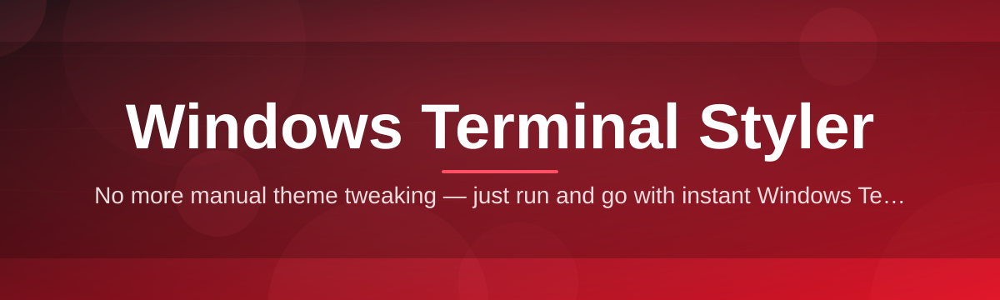
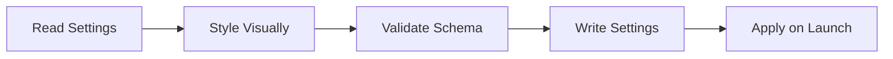

# terminal-style-configurator 🎨🖥️

  

*Turn your Windows Terminal from a blinking cursor into a canvas — no config-file archaeology required.*

  

> [!NOTE]
> **TL;DR**
> - 🎨 A visual, point-and-click Windows Terminal Styler for themes, fonts, acrylic blur, and cursor tricks.
> - 🖱️ Zero JSON-editing required — every setting is a slider, swatch, or toggle.
> - ⚡ Standalone `.exe`, no dependencies, no background services, done in under two minutes.

---

## 🔭 Overview

**TL;DR:** *terminal-style-configurator is a GUI layer that sits on top of Windows Terminal's `settings.json`, so you style your shell visually instead of hand-editing config trees.*

Windows Terminal is genuinely great — tabs, panes, GPU-accelerated rendering, all of it. But its styling story lives inside a nested JSON file that punishes typos and rewards patience you probably don't have after a long day of actual coding. `terminal-style-configurator` exists to close that gap. It's a Windows Terminal Styler that renders every color scheme, font pairing, background image, and opacity curve as a live preview, then writes the correct JSON for you behind the scenes. You never touch a bracket.

This project is for developers who spend eight-plus hours a day staring at a terminal window and would like that window to not look like it escaped 2003. It's for dotfile tinkerers who want reproducible themes they can export and share. It's for teams who want a consistent terminal look across a company's dev machines without shipping a 40-line JSON diff in a wiki page nobody reads. Whether you're chasing a minimalist monochrome aesthetic, a neon synthwave vibe, or a faithful recreation of your favorite retro CRT, the configurator gets you there with sliders, not syntax.

Under the hood, it's still "just" a terminal theme editor and profile manager — but the experience is built to feel like a design tool, not a settings menu. Live preview panes update as you drag, color pickers respect terminal-safe palettes, and every change is reversible. Think of it as the difference between tuning a guitar by ear versus with a strobe tuner — same destination, wildly different amount of frustration getting there.

---

## 🧩 What's In The Box

**TL;DR:** *Ten focused capabilities, each solving one specific terminal-styling headache.*

| Capability | What it actually does |
|---|---|
| 🎨 **Live Theme Canvas** | Drag a color swatch and watch your actual terminal pane repaint in real time — no save-and-reload dance. |
| 🔤 **Font Forge** | Pair Nerd Fonts, ligature-enabled monospace faces, and fallback glyphs with instant rendering checks for missing icons. |
| 🌫️ **Acrylic & Blur Studio** | Dial in background opacity and blur radius with a slider instead of guessing decimal values in JSON. |
| 🖼️ **Backdrop Manager** | Drop in an image, GIF, or gradient and control stretch, position, and tint without breaking text contrast. |
| 🧠 **Smart Contrast Guard** | Warns you when a foreground/background pairing will make text unreadable before you ever save it. |
| 🗂️ **Profile Vault** | Save unlimited named theme profiles and swap between them from a dropdown — work theme, stream theme, demo theme. |
| ⌨️ **Cursor & Caret Lab** | Preview cursor shapes (bar, vintage, filled box, underscore) with adjustable blink timing side by side. |
| 📤 **One-Click Export/Import** | Package a theme as a single shareable file so teammates get your exact setup without copy-pasting JSON blocks. |
| 🧭 **Scheme Library Browser** | Flip through a curated gallery of built-in color schemes — Solarized-adjacent, high-contrast, pastel, and more. |
| 🛡️ **Safe-Write Backups** | Every save auto-backs up your prior `settings.json` so a bad theme choice is one click away from undone. |

> [!TIP]
> Combine **Profile Vault** with **One-Click Export/Import** to keep a "default" fallback theme you can restore instantly if an experimental scheme goes sideways.

---

## 🚀 Getting Rolling

**TL;DR:** *Visit the landing page, grab the executable, run it, style your terminal — no installer wizard, no reboot.*

1. **Visit the landing page** — click the download button anywhere on this page to reach the official project site.

2. **Download the tool** — grab the standalone Windows executable, no bundled installer bloat.

3. **Run it** — double-click. The configurator detects your existing Windows Terminal install and reads its current `settings.json` automatically.

4. **Style away** — pick a scheme, tune fonts and blur, hit save, and reopen Windows Terminal to see it applied.

> [!IMPORTANT]
> Close any running Windows Terminal windows before saving a new theme. The app writes directly to `settings.json`, and an open instance may overwrite your changes on its own exit.

---

## 🖥️ System Requirements

**TL;DR:** *Windows 10 or 11, Windows Terminal installed, nothing else.*

<table>
<tr><td><b>Operating System</b></td><td>Windows 10 (2004+) or Windows 11</td></tr>
<tr><td><b>Dependencies</b></td><td>None — fully standalone, self-contained executable</td></tr>
<tr><td><b>Prerequisite App</b></td><td>Windows Terminal (Store or GitHub release build)</td></tr>
<tr><td><b>Disk Space</b></td><td>Under 50 MB</td></tr>
<tr><td><b>Admin Rights</b></td><td>Not required for normal use</td></tr>
</table>

  

---

## ⚙️ How It Works

**TL;DR:** *Read config → edit visually → validate → write config → Windows Terminal picks it up on next launch.*

The configurator never invents its own theme format. It reads Windows Terminal's real `settings.json`, mirrors it into a friendly visual editor, validates every change against the schema Windows Terminal expects, and writes back a clean, correctly-formatted file. Nothing proprietary, nothing locked-in — you can always open the raw JSON afterward and recognize exactly what changed.

1. **Detect** — locates your Windows Terminal install and its settings file path.

2. **Parse** — loads the JSON into an internal model, so the UI always reflects reality.

3. **Style** — every UI change updates that model live, feeding the preview pane instantly.

4. **Validate** — a schema check catches malformed values before anything touches disk.

5. **Commit** — writes the finalized file, backs up the previous version, done.

---

## 🧯 Troubleshooting

**TL;DR:** *Most issues trace back to file permissions, a running terminal instance, or a missing font.*

<b>My saved theme didn't apply after reopening Windows Terminal</b>

 

Make sure Windows Terminal was fully closed (not just minimized) before you clicked save. If a background instance was still alive, it may have flushed its own in-memory settings over yours on exit.

<b>The configurator says it can't find my settings.json</b>

 

This usually means Windows Terminal was installed in a non-standard way or hasn't been launched yet post-install. Open Windows Terminal once manually to generate the default settings file, then relaunch the configurator.

<b>A font I picked shows boxes instead of icons</b>

 

That font likely isn't a Nerd Font variant and lacks the glyph set for icons used in prompts like Starship or Oh My Posh. Swap to a Nerd Font-patched version from the Font Forge panel.

<b>My acrylic background looks solid instead of blurred</b>

 

Windows transparency effects can be disabled system-wide under Settings → Personalization → Colors → Transparency effects. Turn that on, then re-apply your theme.

<b>Changes save fine but revert after a Windows Terminal update</b>

 

Rare, but occasionally an update resets `settings.json` to defaults. Restore instantly from your Profile Vault or the automatic backup the configurator created on your last save.

> [!WARNING]
> Editing `settings.json` manually while the configurator is open can cause both tools to disagree about the current state. Close one before touching the other.

---

## 🎛️ UI & UX Details

**TL;DR:** *Keyboard-first navigation, light/dark app shell, and every setting has a sane default.*

- `Ctrl+S` — save current theme to active profile

- `Ctrl+N` — create a new blank profile

- `Ctrl+Tab` — cycle through saved profiles

- `Ctrl+Z` / `Ctrl+Y` — undo/redo styling changes

- `Esc` — discard unsaved edits in the current session

The app shell itself ships with a light and dark mode, independent of the terminal theme you're building — because designing a bright neon scheme inside a blinding white editor is nobody's idea of fun. Settings persist between sessions, including your last-used profile, window size, and preview font zoom level.

> [!TIP]
> Hold `Shift` while dragging an opacity slider for fine-grained, single-percent adjustments instead of the default coarse steps.

---

## 🤝 Contributing & Community

**TL;DR:** *Issues, theme submissions, and pull requests are all welcome — this is a community-shaped tool.*

This project grows through the people actually using it daily. Found a rough edge? Open an issue. Built a color scheme you're proud of? Consider submitting it to the built-in Scheme Library Browser via a pull request. Discussions are open for feature requests, and "good first issue" labels are kept current for anyone wanting to make their first contribution to a Windows Terminal Styler project.

- 🐛 Bug reports — include your Windows build number and Windows Terminal version

- 💡 Feature ideas — describe the styling problem, not just the solution you imagine

- 🎨 Theme submissions — export via One-Click Export and attach the file to your PR

- 📖 Docs improv